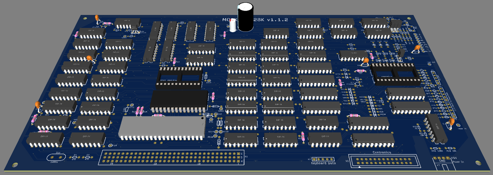

# Москва-128

Данный клон компьтера ZX Spectrum появился, ориентировочно в 1989 году. 

Считается первым отечестывенным клоном с ОЗУ в 128 КБ. Предположительно, является прообразом известного клона 

Особенностями модели являются:
* Интерфейс принтера ZX LPRINT III, позволяющий выводить на печать текст программ. Параллельный интерфейс типа Centronics.
* Возможность подключения 2-х джойстиков. Типа Interface-2.
* Пять программируемых клавиш.

Схема и печатная плата восстановлены со старых сканов и фото, найденых на сайте zx-pk.ru.

Шаг отверстий 2,54мм. Системный разъем, 3x32пин - DIN41612C-96FR. Диодные сборки заменены на обычные диоды типа 1N4148 (КД521 и т.п.). 

Читалка на операционнике заменена на классическую на компараторе К554СА3.

По возможности, были исправлены явные ошибки. Переименованы сигналы, с цифровых обозначений на буквенные, принятые в спектрумостоении :)

Первая версия печатной платы, еще не изготавливалась и не тестировалась.

[Принципиальная схема](Export/Schematic_Moscow-128_v1.1.0.pdf)

[Монтажная схема](Export/PCB_Moscow-128_v1.1.0-TOP.pdf)

[Файлы для производства](Export/Gerbers/Moscow-128_v1.1.0.zip)

## Изменения
* _v1.1.0_ Первая, экспериментальная версия схемы и печатной платы.
